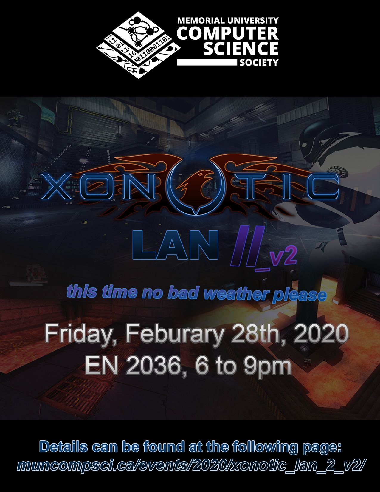

_this time no bad weather please_

##### EN 2036 (CS Student Lab, 6 to 9pm)

 

#### If there is a need (which there will be), money for a pizza will be pooled together, so bring some change if you think you'll be hungry!

_No registration required, just come on down!_

 

#### What is Xonotic? How do I install it? How do I connect to the LAN?

We covered all of these things in the page for the last event, and since **_we're CS students_** that follow the [DRY](https://en.wikipedia.org/wiki/Don%27t_repeat_yourself) principle, [here's the link for that](/events/2019/xonotic-lan/).

 

