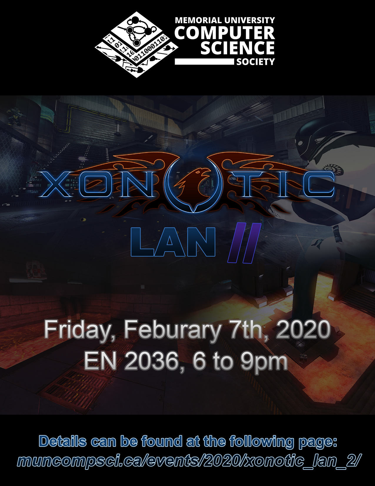

##### EN 2036 (CS Student Lab, 6 to 9pm)

#### There shall be pizza and drinks provided for this event!

_No registration required, just come on down!_

 

#### What is Xonotic? How do I install it? How do I connect to the LAN?

We covered all of these things in the page for the last event, and since **_we're CS students_** that follow the [DRY](https://en.wikipedia.org/wiki/Don%27t_repeat_yourself) principle, [here's the link for that](/events/2019/xonotic-lan/).

 

